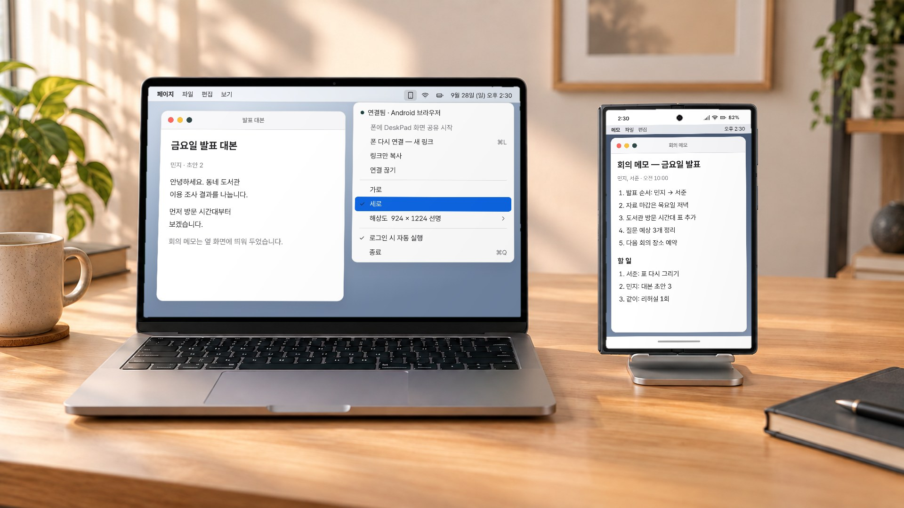
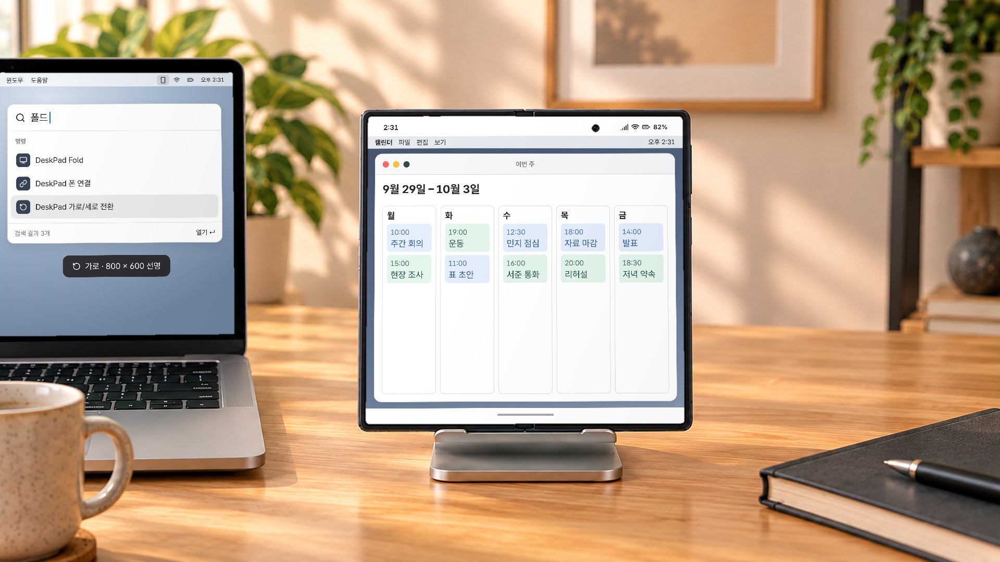
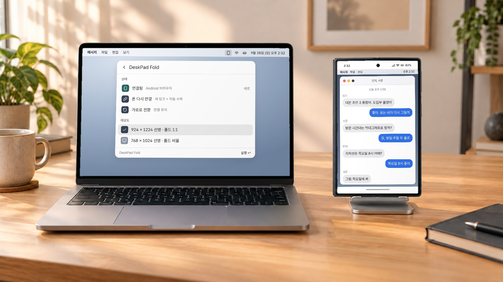
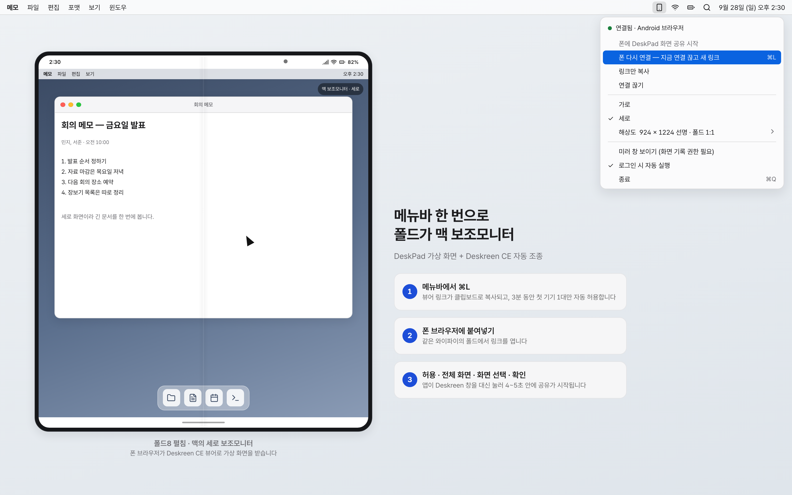
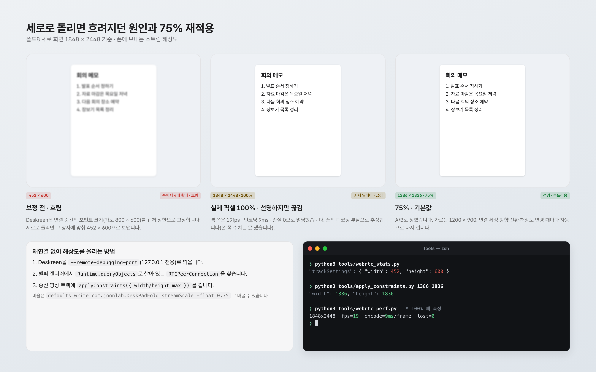
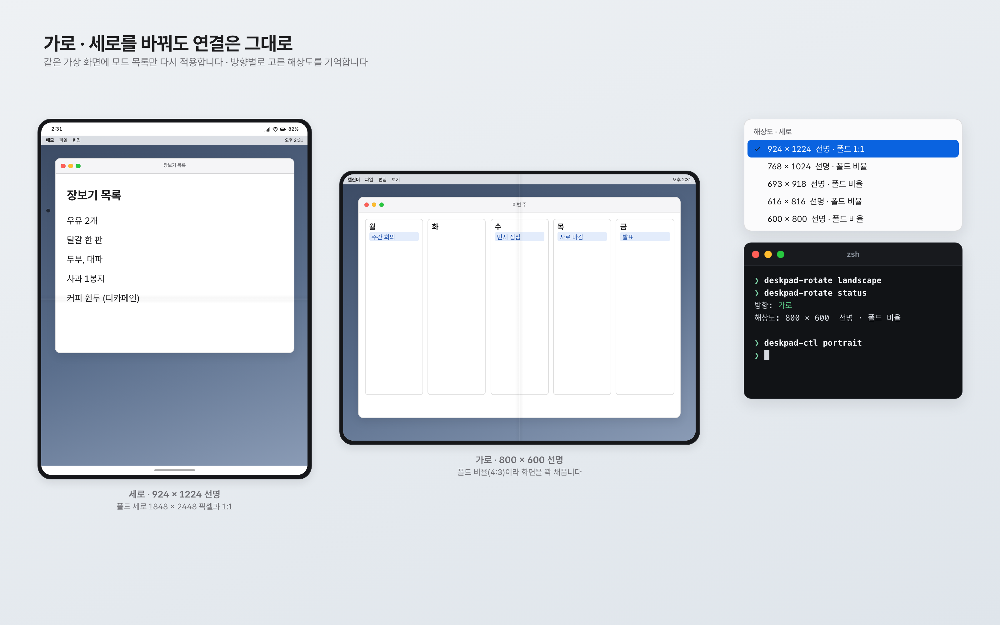
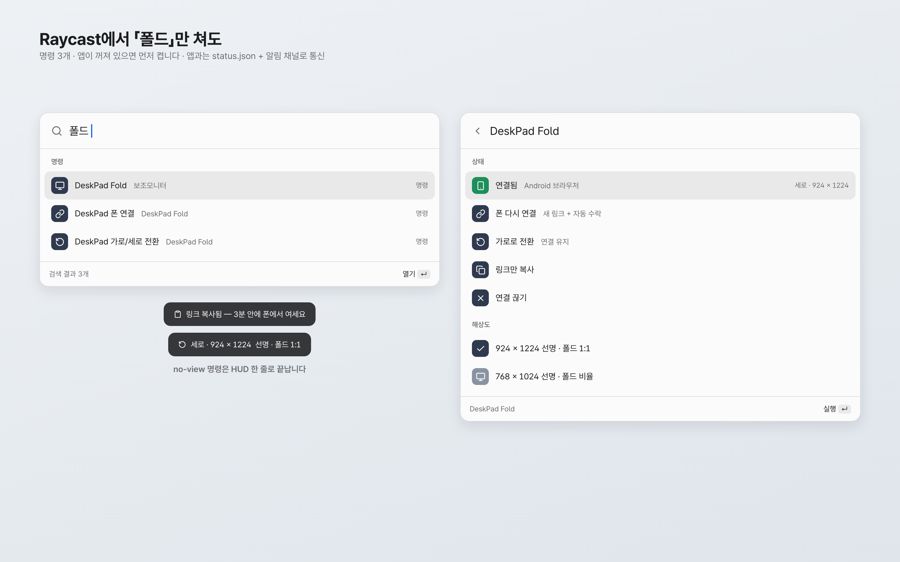
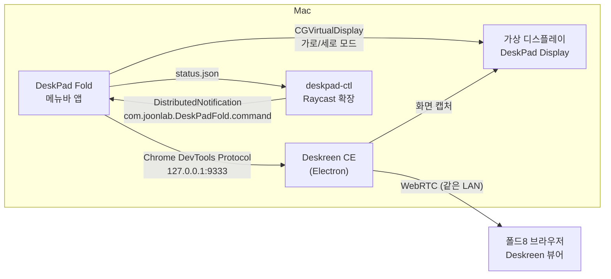

# DeskPad Fold

갤럭시 Z 폴드8을 맥 보조모니터로 씁니다. 메뉴바에서 폰 연결, 가로/세로, 해상도를 고릅니다.

> **English** — An unofficial fork of [DeskPad](https://github.com/Stengo/DeskPad) that turns a Galaxy Z Fold8 into a secondary Mac display via Deskreen CE.
> A menu bar item copies the viewer link, auto-accepts the first phone for 3 minutes, and switches portrait/landscape without dropping the stream.
> It also fixes blurry portrait streams by re-capping Deskreen's WebRTC track at the display's real pixel size (75% by default).

동작 확인: Galaxy Z Fold8 (Android 17) · macOS 26 · Deskreen CE 3.2.16

## 왜 만들었나

저는 아이폰을 10년 쓰다가 폴드8로 넘어왔습니다. 아이폰일 때는 맥과 이어지는 기능이 기본으로 있었는데, 안드로이드로 오니 그 연결을 제가 직접 만들어야 했습니다. 이 레포는 그중 하나로, 펼친 폴드를 맥 옆에 세워 두고 세로 보조모니터로 쓰려고 만들었습니다.

가상 모니터는 [DeskPad](https://github.com/Stengo/DeskPad)가, 폰으로 화면을 보내는 일은 Deskreen CE가 이미 잘 합니다. 불편했던 것은 세 가지였습니다.

- DeskPad의 해상도 목록이 코드에 고정돼 있어 세로 모드가 없었습니다.
- 연결할 때마다 Deskreen 창에서 링크 복사 → 허용 → 전체 화면 → 화면 선택 → 확인을 손으로 눌러야 했습니다.
- 세로로 돌리면 폰 화면이 눈에 띄게 흐려졌습니다.

그래서 DeskPad를 포크해 메뉴바 앱으로 바꾸고, Deskreen CE를 대신 조종하게 했습니다.

## 실제로 이렇게 씁니다


맥 메뉴바의 DeskPad Fold에서 세로를 고르면 → 옆에 세운 폴드8이 세로 보조모니터가 되어 긴 문서를 한 화면에 띄워 둡니다.


폰을 가로로 돌려 세우고 Raycast에서 「DeskPad 가로/세로 전환」을 실행하면 → 연결이 끊기지 않은 채 가로 800 × 600 선명 화면으로 바뀝니다.


Raycast 상태 화면에서 연결·방향을 확인하고 해상도를 924 × 1224 선명(폴드 1:1)으로 고르면 → 폰에 띄운 긴 대화도 흐리지 않게 보입니다.

책상 사진은 AI로 만든 배경이고, 화면은 설명용 목업을 합성했습니다.

## 스크린샷


화면은 설명용 목업입니다.


화면은 설명용 목업입니다.


화면은 설명용 목업입니다.


화면은 설명용 목업입니다.

<!-- VIDEO -->

## 기능

| 기능 | 내용 |
|---|---|
| 폰 연결 (⌘L) | Deskreen을 디버깅 포트로 (재)실행 → 남은 연결 끊기 → 뷰어 링크를 클립보드에 → **3분 동안 첫 기기 1대만** 허용·전체 화면·DeskPad 화면 선택·확인을 자동으로 누릅니다. 링크를 폰에 붙여넣고 공유가 시작되기까지 4~5초 걸렸습니다 |
| 가로 / 세로 | 같은 가상 화면에 모드 목록만 다시 적용합니다. 디스플레이 ID가 그대로라 **폰 연결이 유지**됩니다 |
| 세로 924 × 1224 선명 | 폴드8 세로 1848 × 2448 픽셀과 1:1 인 HiDPI 모드. 가로는 800 × 600 선명(폴드 비율 4:3) |
| 해상도 ▸ | 현재 방향의 사용 가능한 모드. 고른 값은 방향별로 기억합니다 |
| 화질 자동 보정 | 연결 확정·방향 전환·해상도 변경 때마다 Deskreen 송신 트랙의 상한을 실제 픽셀의 75%로 다시 겁니다 (`fitStreams`) |
| 로그인 시 자동 실행 | `SMAppService`. Dock 아이콘 없이 메뉴바에만 있습니다 |
| 미러 창 | 원래 DeskPad 창. 켤 때만 화면을 캡처하므로 폰으로만 쓸 때는 화면 기록 권한이 필요 없습니다 |
| CLI | `tools/deskpad-ctl arm\|copy\|disconnect\|portrait\|landscape\|status\|quit\|mode:<WxH@scale>` · `tools/deskpad-rotate portrait\|landscape\|status` |
| Raycast 확장 | `raycast/` — 상태 보기, 폰 연결, 가로/세로 전환 명령 3개 |

## 구조



- `DeskPad/StatusMenuController.swift` — 메뉴바, 방향·해상도, 자동 수락 루프, 화질 보정
- `DeskPad/DeskreenController.swift` — Deskreen CE 제어(DevTools WebSocket, IPC 호출, 버튼 클릭, `RTCPeerConnection` 조회)
- `DeskPad/Frontend/Screen/ScreenViewController.swift` — 모드 목록·방향·미러 창
- `tools/` — CLI 2개, 설정 스크립트, WebRTC 진단 도구(`webrtc_stats.py` `webrtc_perf.py` `apply_constraints.py` `cdp_eval.py`)
- `raycast/` — Raycast 확장 (자세한 내용은 [raycast/README.md](raycast/README.md))

## 준비물

- macOS 26 맥 (다른 버전은 확인하지 않았습니다)
- Xcode (빌드용)
- Deskreen CE 3.2.16 — `/Applications/Deskreen CE.app`
- 맥과 **같은 와이파이**에 있는 안드로이드 폰(브라우저만 있으면 됩니다)
- 진단 도구를 쓰려면 Python 3 + `pip install websocket-client`

## 설치

```bash
git clone https://github.com/joonlab/deskpad-fold.git
cd deskpad-fold
xcodebuild -project DeskPad.xcodeproj -scheme DeskPad -configuration Release -derivedDataPath build \
  CODE_SIGN_IDENTITY="-" CODE_SIGN_STYLE=Manual DEVELOPMENT_TEAM="" \
  PRODUCT_BUNDLE_IDENTIFIER=com.joonlab.DeskPadFold PRODUCT_NAME="DeskPad Fold" build
ditto "build/Build/Products/Release/DeskPad Fold.app" "/Applications/DeskPad Fold.app"
open "/Applications/DeskPad Fold.app"
```

- ad-hoc 서명이라 다른 맥으로 옮긴 앱은 Gatekeeper가 막을 수 있습니다. 직접 빌드해서 쓰는 것을 전제로 합니다.
- 원본 DeskPad와 **동시에 켜지 마세요.** 가상 화면이 두 개 생깁니다.
- CLI는 `tools/`를 PATH에 넣거나 `ln -s "$PWD/tools/deskpad-ctl" ~/.local/bin/` 처럼 링크합니다.

## 설정

설정할 비밀값은 없습니다. 바꿀 수 있는 값은 세 가지이고, 비워 두면 기본값을 씁니다.

```bash
cp config.example.env config.env   # config.env 는 .gitignore 에 들어 있습니다
tools/deskpad-config config.env    # 앱 설정(defaults)에 반영 → 앱 재실행
tools/deskpad-config --reset       # 기본값으로
```

| 키 | 기본값 | 뜻 |
|---|---|---|
| `DESKREEN_DEBUG_PORT` | 9333 | Deskreen을 띄울 DevTools 포트. 진단 도구도 같은 환경변수를 읽습니다 |
| `DESKREEN_APP_PATH` | `/Applications/Deskreen CE.app` | Deskreen CE 위치 |
| `DESKPAD_STREAM_SCALE` | 0.75 | 폰으로 보내는 해상도 비율(0.25~1.0) |

## 보안에 대해

- Deskreen CE를 `--remote-debugging-port`로 띄웁니다. 포트는 **127.0.0.1에만** 열리지만, 그 사이 같은 맥의 다른 프로세스는 Deskreen 렌더러를 조종할 수 있습니다.
- 자동 수락은 사용자가 연결을 누른 뒤 **3분, 첫 기기 1대**로 한정했습니다. 같은 와이파이의 누군가가 링크를 맞혀 조용히 들어오는 일을 막기 위해서입니다.
- Deskreen을 실행·종료하고 다른 앱에 알림을 받기 위해 앱 샌드박스를 껐습니다(`DeskPad.entitlements`).
- 앱 로그는 `~/Library/Logs/DeskPad Fold.log`에 남고, 여기에는 폰의 LAN IP가 찍힙니다. 공유할 때 주의하세요.

## 알려진 한계

- **Deskreen CE 내부에 기대고 있습니다.** Electron 퓨즈가 열려 있다는 점, IPC 이름(`get-local-lan-ip` 등), 버튼 글자(`허용합니다`/`Allow`, `확인`/`Confirm`), CSS 클래스(`bp6-intent-success`)에 의존합니다. Deskreen이 업데이트되면 깨질 수 있습니다. 3.2.16에서만 확인했습니다.
- Deskreen CE는 뷰어를 1대만 받습니다. 새로 연결하면 기존 연결을 끊습니다.
- 75%는 폴드8 한 대에서 A/B로 체감해 정한 값입니다. 100%(1848 × 2448)에서 맥 쪽은 19fps·인코딩 9ms·손실 0으로 멀쩡했는데 폰에서 커서가 늦고 끊겼습니다. 폰 디코딩 부담으로 추정하지만 폰 쪽 수치는 재지 못했습니다.
- macOS가 어떤 HiDPI 모드를 "사용 가능"으로 표시하는지는 방향 전환 이력에 따라 바뀌었고, 그 규칙은 밝히지 못했습니다. 선호 목록을 순서대로 시도하고 없으면 가장 가까운 선명 모드를 고릅니다.
- 링크가 LAN IP라 맥과 폰이 같은 네트워크에 있어야 합니다.
- 테스트 코드는 없습니다.

## 만든 과정

Claude Code와 함께 하룻밤(약 2시간) 동안 만들었습니다. 기억에 남는 삽질은 이렇습니다.

1. **세로 화질 저하의 원인은 Deskreen의 캡처 상한이었습니다.** Deskreen은 뷰어가 연결되는 순간 디스플레이의 *포인트* 크기(예: 800 × 600)를 `getUserMedia`의 최대 크기로 박고 끝까지 바꾸지 않습니다. 그래서 선명(HiDPI) 모드에서도 절반 해상도로 보냈고, 가로로 연결한 뒤 세로로 돌리면 세로 화면을 800 × 600 상자에 맞춰 452 × 600으로 보냈습니다. 재연결 대신 DevTools의 `Runtime.queryObjects`로 살아 있는 `RTCPeerConnection`을 찾아 송신 트랙에 `applyConstraints`를 걸어 해결했습니다.
2. **"선명할수록 좋다"는 틀렸습니다.** 실제 픽셀 100%로 올리자 글자는 깨끗해졌지만 커서가 끊겼습니다. 맥 쪽 WebRTC 통계를 재서 병목이 맥이 아니라는 것부터 확인하고, 75%로 A/B해서 정했습니다.
3. **방향 전환은 앱 재시작이 아니라 모드 재적용으로.** 가상 디스플레이를 새로 만들면 ID가 바뀌어 폰 스트림이 죽습니다. `CGVirtualDisplay.apply(settings)`로 같은 디스플레이에 모드만 바꾸는 대신, 최대 크기를 3840 × 3840 하나로 둬야 했고 macOS가 일부 작은 HiDPI 모드를 떨구는 부작용을 받아들였습니다.
4. 제가 실제로 쓰고 있던 폰 연결을 재빌드하면서 여러 번 끊었습니다. 쓰는 중인 환경에서 실험하면 이렇게 됩니다.

## 관련 프로젝트

- 허브: [joonlab/android-mac-lab](https://github.com/joonlab/android-mac-lab) — 폴드8과 맥을 잇는 도구 모음
- 원본: [Stengo/DeskPad](https://github.com/Stengo/DeskPad) — 이 레포는 **비공식 포크**입니다. 원작자와 관계가 없습니다.
- 함께 쓰는 앱: Deskreen CE (이 레포에 Deskreen 코드는 들어 있지 않습니다)

## 라이선스

MIT. 원본 DeskPad의 저작권(Copyright (c) 2022 Bastian Andelefski)과 제 변경분의 저작권(Copyright (c) 2026 PARK JOON)을 [LICENSE](LICENSE)에 함께 적었습니다. 원본 라이선스 전문은 [LICENSE.upstream.md](LICENSE.upstream.md)에 그대로 두었습니다. 앱 아이콘(`DeskPad/Assets.xcassets`)과 Raycast 확장 아이콘(`raycast/assets/icon.png`)은 원본 DeskPad의 것입니다.
